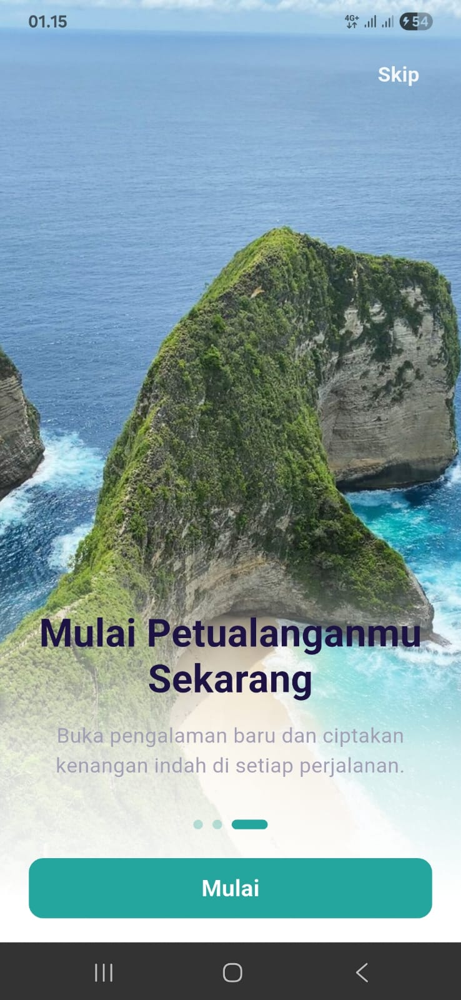
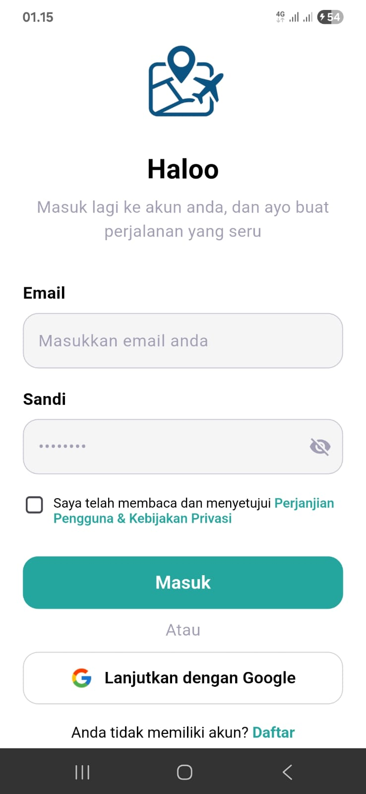
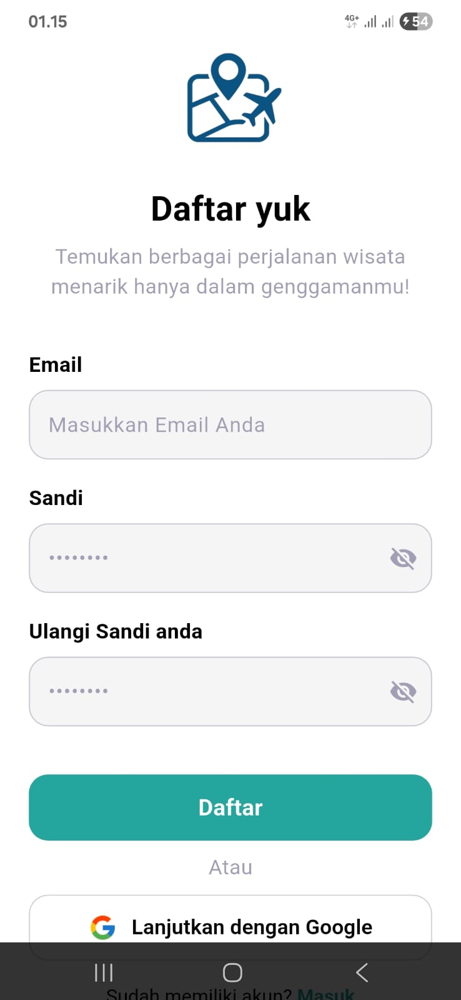
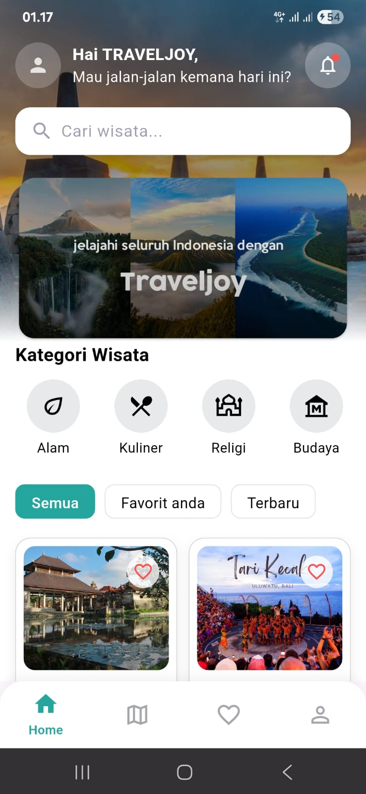
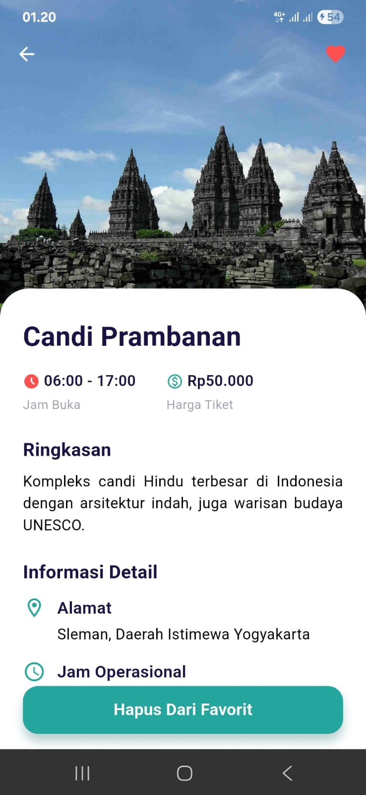
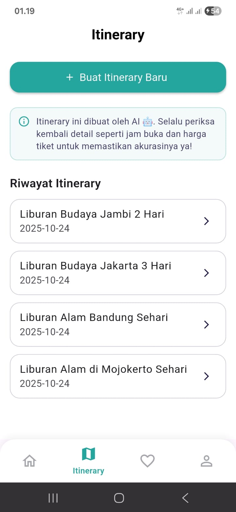
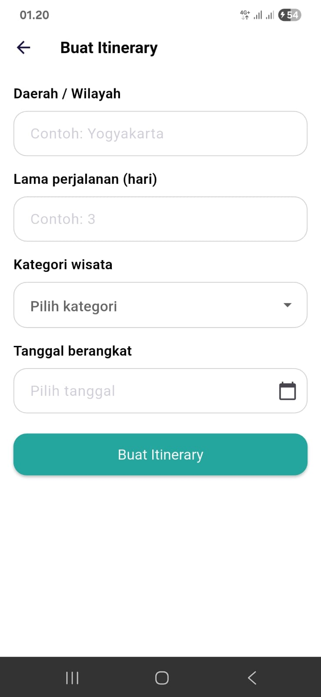
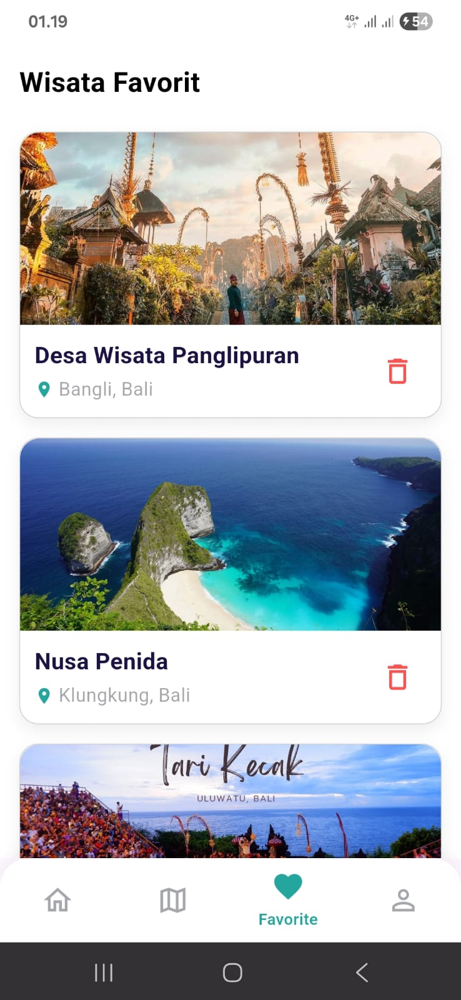
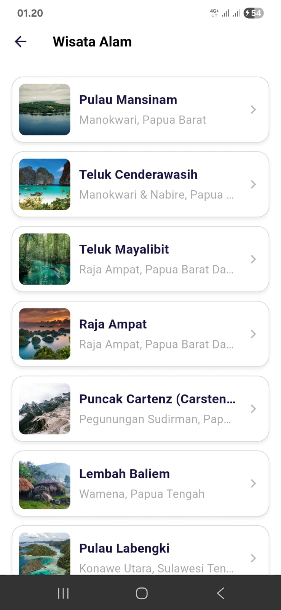
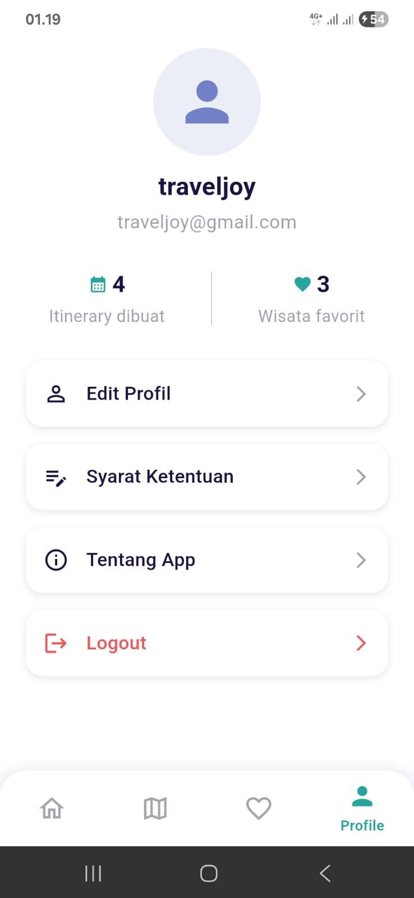

# Traveljoy: Making travel a joy


**Traveljoy** adalah aplikasi mobile lintas platform yang dirancang untuk merevolusi cara wisatawan menjelajahi destinasi di Indonesia.

Proyek ini merupakan Capstone Project untuk program **BEKUP Create: Upskilling Bootcamp 2025** (ID Tim: B25-PG009), dengan tema "Inovasi Teknologi Untuk Digitalisasi Wisata Nusantara".

---

## 🎨 Tampilan Aplikasi (Screenshots)

Berikut adalah beberapa tampilan dari aplikasi Traveljoy:

<table>
  <tr>
    <td align="center">
      
      <br>
      <sub><b>Onboarding</b></sub>
    </td>
    <td align="center">
      
      <br>
      <sub><b>Login</b></sub>
    </td>
    <td align="center">
      
      <br>
      <sub><b>Register</b></sub>
    </td>
    <td align="center">
      
      <br>
      <sub><b>Home</b></sub>
    </td>
    <td align="center">
      
      <br>
      <sub><b>Detail</b></sub>
    </td>
  </tr>
  <tr>
    <td align="center">
      
      <br>
      <sub><b>Itinerary</b></sub>
    </td>
    <td align="center">
      
      <br>
      <sub><b>Buat Itinerary</b></sub>
    </td>
    <td align="center">
      
      <br>
      <sub><b>Favorite</b></sub>
    </td>
    <td align="center">
      
      <br>
      <sub><b>Kategori Wisata</b></sub>
    </td>
    <td align="center">
      
      <br>
      <sub><b>Profile</b></sub>
    </td>
  </tr>
</table>

---

## 💡 1. Latar Belakang & Masalah

Sektor pariwisata di Indonesia merupakan sektor penting, namun digitalisasinya masih terbatas. Sebagian besar aplikasi wisata yang ada saat ini hanya berfungsi sebagai katalog destinasi yang statis.

Wisatawan (terutama generasi muda) menginginkan pengalaman yang cepat, personal, dan interaktif, namun mereka masih harus menyusun jadwal secara manual. Ada kesenjangan antara kebutuhan akan layanan instan dan solusi digital yang ada.

**Traveljoy** hadir sebagai solusi untuk mengatasi masalah ini. Aplikasi ini bukan sekadar katalog, melainkan "asisten perjalanan digital yang cerdas, interaktif, dan menyenangkan" yang memanfaatkan kekuatan Generative AI (Gemini API) dan backend modern (Supabase).

---

## ✨ 2. Fitur Utama

Traveljoy dirancang untuk memberikan pengalaman wisata digital yang lengkap:

* **Rekomendasi & Itinerary Berbasis AI**: Menghasilkan rencana perjalanan dan narasi yang personal. Pengguna dapat memasukkan preferensi seperti durasi, gaya wisata, dan minat, dan Gemini API akan menyusun itinerary yang unik.
* **Eksplorasi Destinasi**: Menampilkan galeri destinasi wisata di seluruh Indonesia, dengan data yang bersumber dari Wonderful Indonesia.
* **Bookmark & Koleksi**: Pengguna dapat menyimpan destinasi atau itinerary favorit mereka untuk diakses kembali nanti.
* **Autentikasi Pengguna**: Sistem login dan manajemen pengguna yang aman menggunakan Supabase Auth.
* **Notifikasi Harian**: Fitur notifikasi untuk meningkatkan keterlibatan (engagement) pengguna.

---

## ⚙️ 3. Instalasi & Konfigurasi

Ikuti langkah-langkah di bawah ini untuk menjalankan proyek ini di mesin lokal Anda.

### Prasyarat

* Pastikan Anda telah menginstal [**Flutter SDK**](https://docs.flutter.dev/get-started/install) (versi 3.19 atau lebih baru).
* Sebuah IDE seperti [**VS Code**](https://code.visualstudio.com/) atau [**Android Studio**](https://developer.android.com/studio).
* Akun [**Supabase**](https://supabase.com/) untuk mendapatkan URL dan Kunci API.
* API Key [**Google AI (Gemini)**](https://aistudio.google.com/app/apikey).

### Langkah-langkah Instalasi

1.  **Clone Repository**
    Buka terminal Anda dan clone repository ini:
    ```bash
    git clone [https://github.com/BEKUP-CAPSTONE/Traveljoy.git](https://github.com/BEKUP-CAPSTONE/Traveljoy.git)
    ```

2.  **Masuk ke Direktori Proyek**
    ```bash
    cd Traveljoy
    ```

3.  **Buat File Konfigurasi Rahasia**
    Buat file baru di dalam folder `assets/` dengan nama `secret.json`.
    ```
    /assets/secrets.json
    ```

4.  **Isi File `secret.json`**
    Salin dan tempel format JSON di bawah ini ke dalam file `secrets.json` Anda, lalu ganti `...` dengan kredensial Anda yang sebenarnya.

    ```json
    {
      "SUPABASE_URL": "URL_PROYEK_SUPABASE_ANDA",
      "SUPABASE_ANON_KEY": "KUNCI_ANON_SUPABASE_ANDA",
      "GEMINI_API_KEY": "API_KEY_GEMINI_ANDA"
    }
    ```
    > **Penting:** Dapatkan kredensial ini dari dashboard proyek Supabase Anda (di bawah *Settings* > *API*) dan dari Google AI Studio.

5.  **Daftarkan Aset di `pubspec.yaml`**
    Buka file `pubspec.yaml` dan pastikan file `secret.json` sudah terdaftar di bawah bagian `assets`:

    ```yaml
    flutter:
      uses-material-design: true
      assets:
        - assets/
        * - assets/secrets.json # <--- Pastikan baris ini ada
    ```

6.  **Instal Dependensi**
    Jalankan perintah berikut untuk mengunduh semua paket yang diperlukan:
    ```bash
    flutter pub get
    ```

7.  **Jalankan Aplikasi**
    Hubungkan perangkat (emulator atau fisik) dan jalankan aplikasi:
    ```bash
    flutter run
    ```

---

## 💻 4. Teknologi yang Digunakan

Proyek ini dibangun dengan fokus pada pengembangan frontend dan backend, menggunakan teknologi berikut:

| Kategori | Teknologi | Deskripsi |
| :--- | :--- | :--- |
| **Bahasa** | Dart | Bahasa pemrograman utama untuk Flutter. |
| **Framework** | Flutter | Membangun antarmuka aplikasi mobile lintas platform yang interaktif dan responsif. |
| **State Management** | Provider | Mengelola state dan alur data di dalam aplikasi Flutter. |
| **Backend & Database** | Supabase | Menyediakan layanan Autentikasi, Database (PostgreSQL), dan Storage (Bucket). |
| **Generative AI** | Gemini API (Google AI) | Menghasilkan itinerary dan narasi perjalanan yang personal berdasarkan input pengguna. |
| **Desain UI/UX** | Figma | Merancang desain awal (wireframes dan mockup) aplikasi. |
| **Kolaborasi** | GitHub & Google Suite | Menggunakan GitHub untuk version control serta Google Calendar & Meet untuk sinkronisasi tim. |
| **API Testing** | Postman | Membantu proses pengujian dan verifikasi API antara frontend dan backend. |

---

## 🤝 5. Tim Pengembang (B25-PG009)

Proyek ini dikerjakan oleh 4 anggota tim dengan pembagian tugas yang terstruktur:

### Frontend Developer
* **(BC25B001) - Khaizul Aftar**
  * Bertanggung jawab atas halaman Home, Detail Destinasi, dan Form Preferensi.
* **(BC25B005) - Taufiq Nurrohman**
  * Bertanggung jawab atas komponen reusable, navigasi (Provider), fitur Bookmark, dan Notifikasi.

### Backend Developer
* **(BC25B009) - Dimas Aswito**
  * Bertanggung jawab atas setup Supabase (Auth, Database), API internal, dan sistem penyimpanan Bookmark.
* **(BC25B002) - Muhammad Salman Alfarisy**
  * Bertanggung jawab atas arstruktur backend AI, integrasi Gemini API, dan penyempurnaan request itinerary.

---
*Proyek ini dibuat dalam jangka waktu 5 minggu sebagai bagian dari BEKUP Create 2025, bekerja sama dengan EKRAF dan Dicoding.*